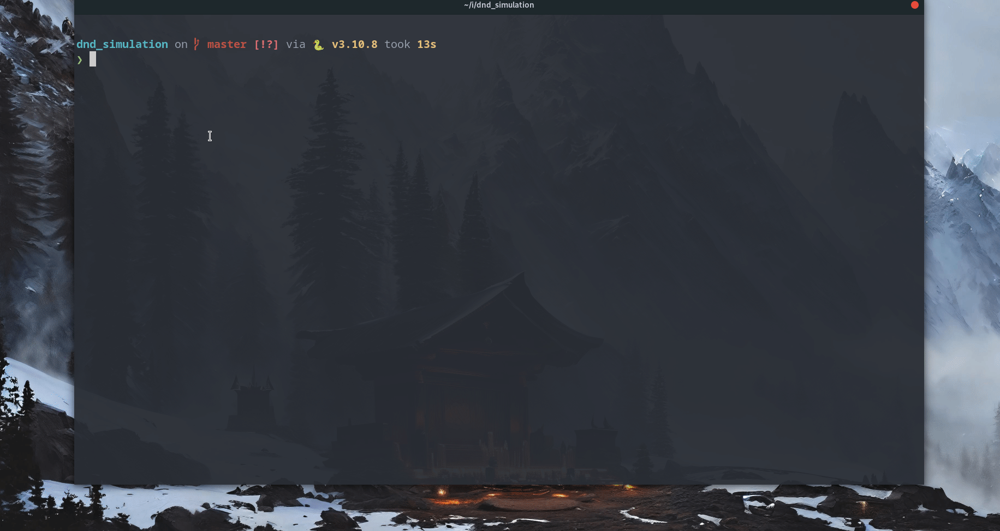

## Simulations of D&D battles

A computational model in Python to visualize combat statistics between two _Dungeons & Dragons_ Characters



## Usage

This project uses _Pipenv_ to manage dependencies and it's recommend run it with Python 3.10

```sh
$ pipenv sync # Install dependiceis
$ pipenv run python main.py 
```

--- 
<p align="left" >


</p>
          